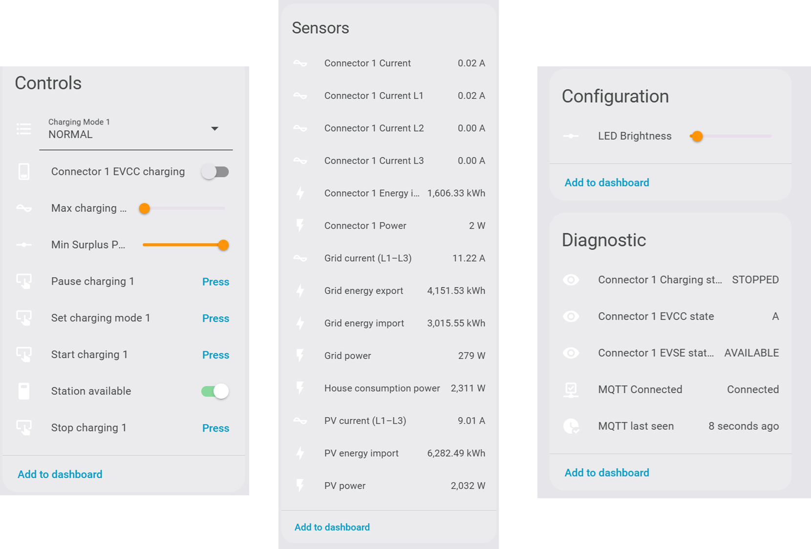

# Smappee EV Home Assistant Integration (HACS)

> [!IMPORTANT]
> This is a personal project developed by me and is not affiliated with, maintained, authorized, or endorsed by Smappee in any way. Use at your own risk.

## 🧠 Credits
The original code started as a fork of [`gvnuland/smappee_ev`](https://github.com/gvnuland/smappee_ev), so credits for the initial working version goes to ""@gvnuland"". 

The codebase has been completely refactored, resulting in a **new and independent integration**. 

This integration is designed to be **complementary to the official Smappee integration**, offering additional control features for Smappee EV charging.

[![HACS][hacs-shield]][hacs-url]
[![Release][release-shield]][release-url]
[![Issues][issues-shield]][issues-url]
[![Usage][usage-shield]][usage-url]
[![Downloads][downloads-shield]][downloads-url]
[![Downloads-latest][downloads-latest-shield]][downloads-latest-url]
[![Hassfest][hassfest-shield]][hassfest-url]
[![Lint][lint-shield]][lint-url]
[![License][license-shield]][license-url]
[![Commits][commits-shield]][commits-url]
[![Stars][stars-shield]][stars-url]
[![Pull Requests][pulls-shield]][pulls-url]
[![Community][community-shield]][community-url]
<!-- This is a comment[![Discord][discord-shield]][discord-url] -->

## 🔧 Features

This custom integration unlocks **more control over your Smappee** charger and connects it directly to Home Assistant. It goes far beyond the official integration, which lacks support for the full EV charger API. It is based on the [Smappee API](https://smappee.atlassian.net/wiki/spaces/DEVAPI/overview) and mqtt.smappee.net.

The main ambition is to have independent control of the Smappee EV charger via Home Assistant and eventually add those sensors in other energy management systems.

### ✅ Charging Mode Control
- Two different service paths to set the charging modes:
  - The regular `smappee_ev.set_charging_mode` service, which works with the integration's existing mode flow (`SMART`, `SOLAR`, `NORMAL`).
  - The newer `smappee_ev.set_charging_mode_chargingstations` service, which calls Smappee's `chargingstations` endpoint directly and supports `NORMAL`, `SMART`, and `PAUSED`, with an optional limit for `NORMAL`. This advanced service seems to be more stable but requires to be manually called.

- Apply the selected UI mode with the **Set Charging Mode** button, take care that this uses the set_charging_mode service.
- Use the `chargingstations` service for direct connector control with `NORMAL`, `SMART`, or `PAUSED`, including an optional limit in `AMPERE` or `PERCENTAGE` when using `NORMAL`

### ✅ Direct Charger Control
- Start, Pause, or Stop charging sessions from Home Assistant
- Set fixed charging **currents** (in Amps)
- Change Wallbox availability (set available/unavailable)
- Target a specific connector directly through the `chargingstations` endpoint when needed, which is especially useful in multi-station setups

### ✅ LED Brightness Control
- Adjust LED ring brightness (%)

### ✅ Charger State Feedback
- Real-time **Session State**:
  - `CHARGING`, `PAUSED`, `SUSPENDED`, etc.
- **EVCC State** for in-depth diagnostics (e.g. state A/B/C/E)
- **EVCC Status** to represent the connector status similar as the dashboard

#### ⚡️ Advanced / Developer Notes
- All values for currents/brightnesses are always **integers** (no floats in UI)
- Integration tested on:  
  - **Smappee EV Wall Home** (single and double cable)
  - **Smappee EV One Business**
  - Should work similarly on other Smappee chargers using the same API

## 📘 Integration into other energy management systems
- [EVCC integration](./docs/EVCC.md) – Learn how to use these Home Assistant sensors for EVCC.
- [openEMS integration](./docs/openEMS.md) - Learn how to use these Home Assistant sensors for openEMS. (under construction)
- [emhass integration](./docs/emhass.md) - Learn how to use these Home Assistant sensors for emhass. (under construction)

> ## ⚠️ Important
> This is a HACS custom integration.
> Do **not** try to add this repository as an **add-on** in Home Assistant - it won't work that way.

## 📦 Installation Instructions
### Step 1. Add the Integration via HACS

> [!NOTE]  
> 🚀 Great news! The integration has been **officially approved by HACS**, no need to add it manually anymore! 🎉

### Method 1: Install via HACS (Recommended)

1. In Home Assistant, go to **HACS** → **Integrations**.
2. Search for `Smappee EV`.
3. Click the **download** button in the right bottom side
4. Restart Home Assistant.

### Method 2: Manual Installation

1. Download the latest release from GitHub.
2. Copy the `smappee_ev` folder to your Home Assistant `custom_components` directory.
3. Restart Home Assistant.

### Step 2. Configure the Integration

During setup, you will be prompted to enter:

- **Client ID** and **Client Secret**  
→ Request these by emailing [support@smappee.com](mailto:support@smappee.com)

- **Username** on the Smappee dashboard
- **Password** on the Smappee dashboard
- **Serial number** of your charging station  
→ You can find it in the Smappee dashboard (go to EV line → click to view serial number)

### 🧩 Entities
More information on the specifics of the entities/buttons/services can be found in the [docs](https://github.com/myny-git/smappee_ev/blob/main/docs/HA_integration.md). Take care: names are subject to change as users can rename their Smappee device.

The integration currently exposes two charging-mode paths:
- The regular Home Assistant entities and `smappee_ev.set_charging_mode` service work with the integration's existing mode flow (`SMART`, `SOLAR`, `NORMAL`).
- The newer `smappee_ev.set_charging_mode_chargingstations` service calls Smappee's `chargingstations` endpoint directly and supports `NORMAL`, `SMART`, and `PAUSED`, with an optional limit for `NORMAL`.

This is the current version of the entities (for my EV Wall Home single connector)

> ⚠️ **Note**  
> The Smappee APP is sometimes not correct or responsive. Better to use the online Smappee Dashboard to check functionality.

## 💡 Notes

I built this fork because I own a **Smappee EV Wall Home** and wanted deeper control through Home Assistant.  
The goal is to offer reliable support for charging mode switching and eventually more smart charging controls.
I am also looking into EVCC integration.

Contributions, feedback, or bug reports are very welcome! I am not a programmer, but I'll do my best.

## ☕ Support

If this integration is useful to you, feel free to support its development:

[![BuyMeACoffee][coffee-shield]][coffee-url]
[![PayPal][paypal-shield]][paypal-url]

<!-- Shields -->

[hacs-shield]: https://img.shields.io/badge/HACS-Default-blue.svg?style=flat-square
[hacs-url]: https://hacs.xyz

[release-shield]: https://img.shields.io/github/v/release/myny-git/smappee_ev?color=green&style=flat-square
[release-url]: https://github.com/myny-git/smappee_ev/releases

[issues-shield]: https://img.shields.io/github/issues/myny-git/smappee_ev?style=flat-square
[issues-url]: https://github.com/myny-git/smappee_ev/issues

[usage-shield]: https://img.shields.io/badge/dynamic/json?style=flat-square&logo=home-assistant&logoColor=ccc&label=usage&suffix=%20installs&cacheSeconds=15600&url=https://analytics.home-assistant.io/custom_integrations.json&query=$.smappee_ev.total
[usage-url]: https://my.home-assistant.io/redirect/config_flow_start/?domain=smappee_ev

[hassfest-shield]: https://img.shields.io/github/actions/workflow/status/myny-git/smappee_ev/validate.yaml?label=Hassfest&style=flat-square
[hassfest-url]: https://github.com/myny-git/smappee_ev/actions/workflows/validate.yaml

[license-shield]: https://img.shields.io/badge/License-MIT-yellow.svg?style=flat-square
[license-url]: https://opensource.org/licenses/MIT

[commits-shield]: https://img.shields.io/github/commit-activity/t/myny-git/smappee_ev?style=flat-square
[commits-url]: https://github.com/myny-git/smappee_ev/commits/main

[stars-shield]: https://img.shields.io/github/stars/myny-git/smappee_ev?style=flat-square
[stars-url]: https://github.com/myny-git/smappee_ev/stargazers

[pulls-shield]: https://img.shields.io/github/issues-pr/myny-git/smappee_ev?style=flat-square
[pulls-url]: https://github.com/myny-git/smappee_ev/pulls

[coffee-shield]: https://img.shields.io/badge/Buy%20me%20a%20coffee-donate-yellow?logo=buymeacoffee&style=flat-square
[coffee-url]: https://www.buymeacoffee.com/mynygit

[paypal-shield]: https://img.shields.io/badge/Donate-PayPal-blue?logo=paypal&style=flat-square
[paypal-url]: https://www.paypal.me/mynygit

[lint-shield]: https://img.shields.io/github/actions/workflow/status/myny-git/smappee_ev/lint.yaml?branch=main&label=Lint&style=flat-square&logo=ruff
[lint-url]: https://github.com/myny-git/smappee_ev/actions/workflows/lint.yaml

[downloads-shield]: https://img.shields.io/github/downloads/myny-git/smappee_ev/total?style=flat-square
[downloads-url]: https://my.home-assistant.io/redirect/config_flow_start/?domain=smappee_ev

[downloads-latest-shield]: https://img.shields.io/github/downloads/myny-git/smappee_ev/latest/total?style=flat-square
[downloads-latest-url]: https://my.home-assistant.io/redirect/config_flow_start/?domain=smappee_ev

[community-shield]: https://img.shields.io/badge/Forum-Home%20Assistant-blue?style=flat-square&logo=home-assistant
[community-url]: https://community.home-assistant.io/t/smappee-ev/915116

[discord-shield]: https://img.shields.io/badge/Discord-Chat-blue?style=flat-square&logo=discord&logoColor=white
[discord-url]: https://discord.gg/CHnVjqDQ

