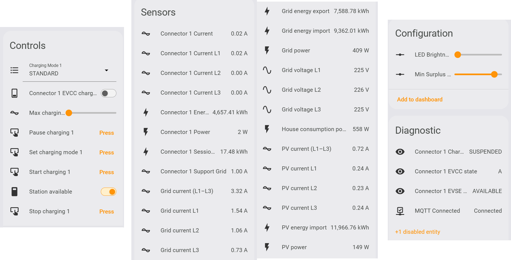

# Smappee EV Home Assistant Integration (HACS)

> [!IMPORTANT]
> This is a personal project developed by me and I am not affiliated with Smappee in any way. Use at your own risk.

## 🧠 Credits

This Home Assistant integration provides an integration for Smappee devices, including extended control features for Smappee EV chargers with charging modes, current limits, availability control, LED brightness, and status feedback. It is intended for users who want to integrate their Smappee EV charger more deeply into Home Assistant, EVCC, or other energy management setups. Depending on your device and configuration, energy-related data may also be available. 

Feel free to join the Discord channel if you have questions, want to share feedback, or would like to contribute!

<div align="center">

[![HACS][hacs-shield]][hacs-url]
[![Release][release-shield]][release-url]
[![Issues][issues-shield]][issues-url]
[![Usage][usage-shield]][usage-url]
[![Downloads][downloads-shield]][downloads-url]
[![Downloads-latest][downloads-latest-shield]][downloads-latest-url]
[![Hassfest][hassfest-shield]][hassfest-url]
[![Lint][lint-shield]][lint-url]
[![License][license-shield]][license-url]
[![Commits][commits-shield]][commits-url]
[![Stars][stars-shield]][stars-url]
[![Pull Requests][pulls-shield]][pulls-url]
[![Community][community-shield]][community-url]
[![Discord][discord-shield]][discord-url]
</div>

## 🔧 Features

This custom integration unlocks **more control over your Smappee** charger and connects it directly to Home Assistant. It goes far beyond the official integration, which lacks support for the full EV charger API. It is based on the Smappee dashboard api-calls and mqtt.smappee.net.

### API architecture

- MQTT remains the live data source for power, current, energy and fast charger state.
- Smappee Dashboard REST API v10/v11 is used for discovery, station details, charger configuration, capacity protection, overload protection, recent sessions and charger availability.
- Dashboard v10/v11 calls are used for charging mode, start, pause, stop, percentage/current limit, LED brightness, min surplus percentage and availability.
- Deprecated legacy service names are removed during setup when Home Assistant still has them registered from an older version.
- Dashboard configuration data refreshes at most every 30 minutes, with a forced refresh shortly after supported dashboard writes.

### ✅ Charging Mode Control

- UI controls (select, number slider, **Set Charging Mode** button) use Dashboard v10 actions when a Dashboard token is available.
- The EVCC switch uses Dashboard v10 actions for enable (`STANDARD`) and disable (`PAUSED`) when a Dashboard token is available.
- `smappee_ev.set_charging_mode` sets mode via the same dashboard-first path: `STANDARD`, `SMART`, or `SOLAR`.

### ✅ Direct Charger Control

- Pause charging via **`smappee_ev.pause_charging`** (Dashboard v10 action)
- Stop charging sessions from Home Assistant
- Set fixed charging **currents** (in Amps)
- Change Wallbox availability (set available/unavailable)
- Target a specific connector by selecting `service_location_id` and/or `connector_id`, which is especially useful in multi-station setups

### ✅ LED Brightness Control

- Adjust LED ring brightness (%) via Dashboard v10 config writes when a Dashboard token is available.

### ✅ Charger State Feedback

- Real-time **Session State**:
  - `CHARGING`, `PAUSED`, `SUSPENDED`, etc.
- **EVCC State** for in-depth diagnostics (e.g. state A/B/C/E)
- **EVCC Status** to represent the connector status similar as the dashboard
- **Session energy** sensor per connector: shows the latest Smappee cloud charging session energy in kWh and exposes the session metadata as attributes
- **Support Grid** sensor per connector: shows the maximum grid assistance current (A) configured on the charger
- **Charging mode** is correctly restored from Home Assistant's persistent state after a restart (MQTT confirms or corrects it shortly after boot)

#### ⚡️ Advanced / Developer Notes

- All values for currents/brightnesses are always **integers** (no floats in UI)
- Integration tested on:  
  - **Smappee EV Wall Home** (single and double cable)
  - **Smappee EV One Business**
  - Should work similarly on other Smappee chargers using the same API

## 📘 Integration into other energy management systems

- [EVCC integration](./docs/EVCC.md) – Learn how to use these Home Assistant sensors for EVCC.
- [openEMS integration](./docs/openEMS.md) - Learn how to use these Home Assistant sensors for openEMS. (under construction)
- [emhass integration](./docs/emhass.md) - Learn how to use these Home Assistant sensors for emhass. (under construction)

> ## ⚠️ Important
>
> This is a HACS custom integration.
> Do **not** try to add this repository as an **add-on** in Home Assistant - it won't work that way.

## 📦 Installation Instructions

### Step 1. Add the Integration via HACS

> [!NOTE]  
> 🚀 Great news! The integration has been **officially approved by HACS**, no need to add it manually anymore! 🎉

[](https://my.home-assistant.io/redirect/hacs_repository/?owner=myny-git&repository=smappee_ev&category=integration)

### Method 1: Install via HACS (Recommended)

1. In Home Assistant, go to **HACS** → **Integrations**.
2. Search for `Smappee EV`.
3. Click the **download** button in the right bottom side
4. Restart Home Assistant.

### Method 2: Manual Installation

1. Download the latest release from GitHub.
2. Copy the `smappee_ev` folder to your Home Assistant `custom_components` directory.
3. Restart Home Assistant.

### Step 2. Configure the Integration

During setup, you will be prompted to enter:

- **Username** on the Smappee dashboard
- **Password** on the Smappee dashboard

### 🧩 Entities

More information on the specifics of the entities/buttons/services can be found in the [docs](https://github.com/myny-git/smappee_ev/blob/main/docs/HA_integration.md). Take care: names are subject to change as users can rename their Smappee device.

All main UI controls (select, buttons, number slider, EVCC switch and LED light) use Dashboard v10/v11 calls when Dashboard authentication and device ids are available. The integration no longer documents or exposes the old legacy control path.

This is the current version of the entities (for my EV Wall Home single connector)



> ⚠️ **Note**  
> The Smappee APP is sometimes not correct or responsive. Better to use the online Smappee Dashboard to check functionality.

## 📐 Automation Blueprints

### Smappee: Forgot to Scan RFID Badge

Sends a push notification to your phone when your EV has been plugged into the Smappee charger for a configurable amount of time without starting a charging session — a reminder to scan your RFID badge.

#### What it does

- **Monitors charger status:** Watches for the `cable_connected` state on your Smappee EVSE sensor.
- **Configurable delay:** Waits a set amount of time (default: 5 minutes) before alerting, to allow for normal badge scanning.
- **Mobile notification:** Sends a push notification to your phone via the Home Assistant Companion app.

#### Easy Import

Click the button below to import this blueprint into your Home Assistant instance:

[](https://my.home-assistant.io/redirect/blueprint_import/?blueprint_url=https%3A%2F%2Fgithub.com%2Fmyny-git%2Fsmappee_ev%2Fblob%2Fmain%2Fblueprints%2Fautomation%2Fforgot_to_scan_rfid_badge.yaml)

#### Manual Setup

1. Download `blueprints/automation/forgot_to_scan_rfid_badge.yaml`.
2. Place it in your Home Assistant config directory:

   ```bash
   config/blueprints/automation/forgot_to_scan_rfid_badge.yaml

   ```

3. Go to **Settings → Automations & Scenes → Blueprints**, click **Reload Blueprints**, then **Create Automation**.

## 💡 Notes

I built this fork because I own a **Smappee EV Wall Home** and wanted deeper control through Home Assistant.  
The goal is to offer reliable support for charging mode switching and eventually more smart charging controls.
I am also looking into EVCC integration.

Contributions, feedback, or bug reports are very welcome! I am not a programmer, but I'll do my best.  
If you want to contribute to this please read the [Contribution guidelines](CONTRIBUTING.md)


## ☕ Support

If this integration is useful to you, feel free to support its development:

[![BuyMeACoffee][coffee-shield]][coffee-url]
[![PayPal][paypal-shield]][paypal-url]

<!-- Shields -->

[hacs-shield]: https://img.shields.io/badge/HACS-Default-blue.svg?style=flat-square
[hacs-url]: https://hacs.xyz

[release-shield]: https://img.shields.io/github/v/release/myny-git/smappee_ev?color=green&style=flat-square
[release-url]: https://github.com/myny-git/smappee_ev/releases

[issues-shield]: https://img.shields.io/github/issues/myny-git/smappee_ev?style=flat-square
[issues-url]: https://github.com/myny-git/smappee_ev/issues

[usage-shield]: https://img.shields.io/badge/dynamic/json?style=flat-square&logo=home-assistant&logoColor=ccc&label=usage&suffix=%20installs&cacheSeconds=15600&url=https://analytics.home-assistant.io/custom_integrations.json&query=$.smappee_ev.total
[usage-url]: https://my.home-assistant.io/redirect/config_flow_start/?domain=smappee_ev

[hassfest-shield]: https://img.shields.io/github/actions/workflow/status/myny-git/smappee_ev/validate.yaml?label=Hassfest&style=flat-square
[hassfest-url]: https://github.com/myny-git/smappee_ev/actions/workflows/validate.yaml

[license-shield]: https://img.shields.io/badge/License-MIT-yellow.svg?style=flat-square
[license-url]: https://opensource.org/licenses/MIT

[commits-shield]: https://img.shields.io/github/commit-activity/t/myny-git/smappee_ev?style=flat-square
[commits-url]: https://github.com/myny-git/smappee_ev/commits/main

[stars-shield]: https://img.shields.io/github/stars/myny-git/smappee_ev?style=flat-square
[stars-url]: https://github.com/myny-git/smappee_ev/stargazers

[pulls-shield]: https://img.shields.io/github/issues-pr/myny-git/smappee_ev?style=flat-square
[pulls-url]: https://github.com/myny-git/smappee_ev/pulls

[coffee-shield]: https://img.shields.io/badge/Buy%20me%20a%20coffee-donate-yellow?logo=buymeacoffee&style=flat-square
[coffee-url]: https://www.buymeacoffee.com/mynygit

[paypal-shield]: https://img.shields.io/badge/Donate-PayPal-blue?logo=paypal&style=flat-square
[paypal-url]: https://www.paypal.me/mynygit

[lint-shield]: https://img.shields.io/github/actions/workflow/status/myny-git/smappee_ev/lint.yaml?branch=main&label=Lint&style=flat-square&logo=ruff
[lint-url]: https://github.com/myny-git/smappee_ev/actions/workflows/lint.yaml

[downloads-shield]: https://img.shields.io/github/downloads/myny-git/smappee_ev/total?style=flat-square
[downloads-url]: https://my.home-assistant.io/redirect/config_flow_start/?domain=smappee_ev

[downloads-latest-shield]: https://img.shields.io/github/downloads/myny-git/smappee_ev/latest/total?style=flat-square
[downloads-latest-url]: https://my.home-assistant.io/redirect/config_flow_start/?domain=smappee_ev

[community-shield]: https://img.shields.io/badge/Forum-Home%20Assistant-blue?style=flat-square&logo=home-assistant
[community-url]: https://community.home-assistant.io/t/smappee-ev/915116

[discord-shield]: https://img.shields.io/badge/Discord-Chat-blue?style=flat-square&logo=discord&logoColor=white
[discord-url]: https://discord.gg/43uydPgaNf

## Star History

<a href="https://www.star-history.com/?repos=myny-git%2FSmappee_EV&type=date&legend=top-left">
 <picture>
   <source media="(prefers-color-scheme: dark)" srcset="https://api.star-history.com/chart?repos=myny-git/Smappee_EV&type=date&theme=dark&legend=top-left" />
   <source media="(prefers-color-scheme: light)" srcset="https://api.star-history.com/chart?repos=myny-git/Smappee_EV&type=date&legend=top-left" />
   
 </picture>
</a>

