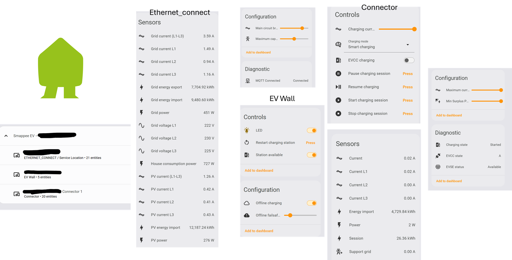

# Smappee EV Home Assistant Integration (HACS)

> [!IMPORTANT]
> This is a personal project developed by me and I am not affiliated with Smappee in any way. Use at your own risk.

## About

Device registration supports both the newer Home Assistant registry API and the legacy API
used before Home Assistant 2026.8.

This Home Assistant integration provides extended local control and monitoring for Smappee EV chargers, including charging modes, current limits, availability control, LED brightness, and status feedback. It is intended for users who want to integrate their Smappee EV charger more deeply into Home Assistant, EVCC, or other energy management setups. Depending on your device and configuration, energy-related data may also be available.

Feel free to join the Discord channel if you have questions, want to share feedback, or would like to contribute!

<div align="center">

[![HACS][hacs-shield]][hacs-url]
[![Release][release-shield]][release-url]
[![Issues][issues-shield]][issues-url]
[![Usage][usage-shield]][usage-url]
[![Downloads][downloads-shield]][downloads-url]
[![Downloads-latest][downloads-latest-shield]][downloads-latest-url]
[![Hassfest][hassfest-shield]][hassfest-url]
[![Lint][lint-shield]][lint-url]
[![Coverage][coverage-shield]][coverage-url]
[![License][license-shield]][license-url]
[![Commits][commits-shield]][commits-url]
[![Stars][stars-shield]][stars-url]
[![Pull Requests][pulls-shield]][pulls-url]
[![Community][community-shield]][community-url]
[![Discord][discord-shield]][discord-url]
</div>

## Breaking changes in the 2026.7.x version

> [!CAUTION]
> Review your Home Assistant configuration after upgrading. Entity names and
> device assignments have changed and older config entries may rebuild their
> entity/device registry during reauthentication. As a result, entity IDs can
> change.

## 🔧 Features

This custom integration unlocks **more control over your Smappee** charger and connects it directly to Home Assistant. It is based on the Smappee Dashboard API calls and mqtt.smappee.net.

### API architecture

- MQTT remains the live data source for power, current, energy and fast charger state.
- Smappee Dashboard REST API v10/v11 is used for discovery, station details, charger configuration, capacity protection, overload protection, recent sessions and charger availability.
- Dashboard v10/v11 calls are used for charging mode, start, pause, stop, percentage/current limit, LED brightness, min surplus percentage and availability.
- Dashboard configuration data refreshes at most every 30 minutes, with a forced refresh shortly after supported dashboard writes.

### MQTT measurements and connector targeting

Power, current, voltage and energy fields are processed independently. An omitted,
empty, invalid or truncated mapped measurement group keeps its previous value; an
explicit zero remains a valid measurement. Incomplete phase arrays are not filled
with synthetic zeros. This does not change the existing energy-counter reset policy.

Connector services require an unambiguous match. If two charging stations both
have connector 1, include `station_serial` to identify the intended station:

```yaml
action: smappee_ev.set_current
data:
  service_location_id: 123
  station_serial: "YOUR_STATION_SERIAL"
  connector_id: 1
  current: 10
```

The same optional field is available for start, pause, stop, resume and charging
mode actions. Ambiguous calls now fail instead of selecting the first station;
existing automations using ambiguous connector numbers must add the serial.

Capacity and overload site settings now have unique IDs independent of the
selected charging station. Existing registry entries are migrated in place during
number platform setup, preserving entity IDs and user customizations. If duplicate
entries already exist, they are retained and a warning is logged; they are not
automatically deleted.

### Monitoring during Dashboard outages

After a successful setup, the integration saves the MQTT connection settings and
device mapping in Home Assistant storage. If Dashboard is temporarily unavailable
during a later reload or Home Assistant restart, this saved configuration lets
MQTT monitoring start independently. Maintenance responses, connection failures,
timeouts and HTTP 408, 429 and 5xx responses can activate this fallback. Authentication errors
still require reauthentication; they do not activate fallback during setup.

Saving the configuration requires valid discovery data for every expected
measurement location. A temporary failure to refresh live station or connector
REST state does not prevent this first cache from being saved. Incomplete
measurement discovery does not replace an existing cache. Cache creation is
attempted during normal setup, not periodically during operation.

The diagnostic **Connection mode** sensor shows `mqtt_only` when using this saved
configuration. Dashboard controls and REST-only entities are unavailable, and
service actions fail with an explanatory message. MQTT measurements become
available after live data arrives for the site or connector. They become
unavailable if the broker disconnects or no matching data arrives for five minutes
(checked every 30 seconds). Stored device metadata is not used as live telemetry.

Dashboard recovery runs in the background, starting after 30 seconds. Failed
attempts increase the delay, with jitter, up to ten minutes. For HTTP 429, the
server's `Retry-After` delay is respected even when longer than ten minutes; new
Dashboard requests are held back during that period. Once full discovery
succeeds and station and connector REST state is reachable, the integration
reloads automatically to restore normal operation. This
reload briefly interrupts MQTT. If recovery discovers invalid credentials, Home
Assistant requests reauthentication while the existing MQTT monitoring continues.
During normal operation, MQTT updates also leave REST polling scheduled so that
Dashboard can recover without a manual reload.

Fallback requires at least one successful setup with this version and a valid
saved configuration. Without it, Home Assistant retries setup normally. The last
saved configuration has no expiry time and is refreshed on successful normal
setup; changed device mappings or expired MQTT credentials can prevent monitoring
until Dashboard returns. The MQTT broker and network must remain reachable, and
missed measurements are not backfilled.

The private storage file contains MQTT credentials and device routing metadata,
but no saved live measurements or charging sessions. Like other Home Assistant
storage files, it is not separately encrypted: protect access to the configuration
directory and backups. Removing the integration entry deletes its saved MQTT
configuration. Diagnostics do not include these credentials.

### ✅ Charging Mode Control

- UI controls (select, number slider, **Set Charging Mode** button) use Dashboard v10 actions when a Dashboard token is available.
- The EVCC switch uses Dashboard v10 actions for enable (`STANDARD`) and disable (`PAUSED`) when a Dashboard token is available.
- `smappee_ev.set_charging_mode` sets mode via the same dashboard-first path: `STANDARD`, `SMART`, or `SOLAR`.

### ✅ Direct Charger Control

- Pause charging via **`smappee_ev.pause_charging`** (Dashboard v10 action)
- Stop charging sessions from Home Assistant
- Set fixed charging **currents** (in Amps, with one decimal step)
- Change Wallbox availability (set available/unavailable)
- Target a specific connector by selecting `service_location_id` and/or `connector_id`, which is especially useful in multi-station setups

### ✅ LED Brightness Control

- Adjust LED ring brightness (%) via Dashboard v10 config writes when a Dashboard token is available.

### ✅ Cable Lock Control

- Lock/unlock the charging cable in the connector socket via Dashboard v11 (`cableLocked`), matching the dashboard's charger configuration Lock/Unlock button.
- Only available on charging stations with a socket connector (not fixed-cable models). The `lock` entity reports as unavailable when the Dashboard API never reports a cable lock state for your station.

### ✅ Charger State Feedback

- Real-time **Session State**:
  - `charging`, `paused`, `suspended`, etc.
- **EVCC State** for in-depth diagnostics (e.g. state A/B/C/E)
- **EVCC Status** to represent the connector status similar as the dashboard
- **Always-on power** sensor for the site's background or standby consumption, based on the MQTT `alwaysOn` value
- **Session energy** sensor per connector: shows the latest Smappee cloud charging session energy in kWh and exposes the session metadata as attributes
- **Support Grid** sensor per connector: shows the maximum grid assistance current (A) configured on the charger
- **Charging mode** is correctly restored from Home Assistant's persistent state after a restart (MQTT confirms or corrects it shortly after boot)

#### ⚡️ Advanced / Developer Notes

- Most values for currents/brightnesses are always **integers** (no floats in UI), except for current limits which are **1 decimal precision**. The integration converts the requested current to the nearest supported percentage for the connector's configured range.
- Integration tested on:  
  - **Smappee EV Wall Home** (single and double cable)
  - **Smappee EV One Business**
  - Should work similarly on other Smappee chargers using the same API

## 📘 Integration into other energy management systems

- [EVCC integration](./docs/EVCC.md) – Learn how to use these Home Assistant sensors for EVCC.
- [openEMS integration](./docs/openEMS.md) - Learn how to use these Home Assistant sensors for openEMS. (under construction)
- [emhass integration](./docs/emhass.md) - Learn how to use these Home Assistant sensors for emhass. (under construction)

> ## ⚠️ Important
>
> This is a HACS custom integration.
> Do **not** try to add this repository as an **add-on** in Home Assistant - it won't work that way.

## 📦 Installation Instructions

### Step 1. Add the Integration via HACS

> [!NOTE]  
> 🚀 Great news! The integration has been **officially approved by HACS**, no need to add it manually anymore! 🎉

[](https://my.home-assistant.io/redirect/hacs_repository/?owner=myny-git&repository=smappee_ev&category=integration)

### Method 1: Install via HACS (Recommended)

1. In Home Assistant, go to **HACS** → **Integrations**.
2. Search for `Smappee EV`.
3. Click the **download** button in the right bottom side
4. Restart Home Assistant.

### Method 2: Manual Installation

1. Download the latest release from GitHub.
2. Copy the `smappee_ev` folder to your Home Assistant `custom_components` directory.
3. Restart Home Assistant.

### Step 2. Configure the Integration

During setup, you will be prompted to enter:

- **Username** on the Smappee dashboard
- **Password** on the Smappee dashboard

### 🧩 Entities

More information on the specifics of the entities/buttons/services can be found in the [docs](https://github.com/myny-git/smappee_ev/blob/main/docs/HA_integration.md). Take care: names are subject to change as users can rename their Smappee device.

All main UI controls (select, buttons, number slider, EVCC switch and LED light) use Dashboard v10/v11 calls when Dashboard authentication and device ids are available. The integration no longer documents or exposes the old legacy control path.

This is the current version of the entities (for my EV Wall Home single connector)



> ⚠️ **Note**  
> The Smappee APP is sometimes not correct or responsive. Better to use the online Smappee Dashboard to check functionality.

## 📐 Automation Blueprints

See the [Blueprints documentation](./docs/blueprints.md) for the full list of available blueprints, including:

- **Forgot to Scan RFID Badge** – notifies you when a car is connected but no session has started.
- **Charger Status and Sun-Based LED Brightness** – adjusts LED brightness based on charger state and sun position.
- **Module Offline Warning** – alerts you when a Smappee sensor goes unavailable.

## 💡 Notes

I built this project because I own a **Smappee EV Wall Home** and wanted deeper control through Home Assistant.  
The goal is to offer reliable support for charging mode switching and eventually more smart charging controls.
I am also looking into EVCC integration.

Contributions, feedback, or bug reports are very welcome! I am not a programmer, but I like it a lot.  
If you want to contribute to this please read the [Contribution guidelines](CONTRIBUTING.md)


## ☕ Support

If this integration is useful to you, feel free to support its development:

[![BuyMeACoffee][coffee-shield]][coffee-url]
[![PayPal][paypal-shield]][paypal-url]

<!-- Shields -->

[hacs-shield]: https://img.shields.io/badge/HACS-Default-blue.svg?style=flat-square
[hacs-url]: https://hacs.xyz

[release-shield]: https://img.shields.io/github/v/release/myny-git/smappee_ev?color=green&style=flat-square
[release-url]: https://github.com/myny-git/smappee_ev/releases

[issues-shield]: https://img.shields.io/github/issues/myny-git/smappee_ev?style=flat-square
[issues-url]: https://github.com/myny-git/smappee_ev/issues

[usage-shield]: https://img.shields.io/badge/dynamic/json?style=flat-square&logo=home-assistant&logoColor=ccc&label=usage&suffix=%20installs&cacheSeconds=15600&url=https://analytics.home-assistant.io/custom_integrations.json&query=$.smappee_ev.total
[usage-url]: https://my.home-assistant.io/redirect/config_flow_start/?domain=smappee_ev

[hassfest-shield]: https://img.shields.io/github/actions/workflow/status/myny-git/smappee_ev/validate.yaml?label=Hassfest&style=flat-square
[hassfest-url]: https://github.com/myny-git/smappee_ev/actions/workflows/validate.yaml

[license-shield]: https://img.shields.io/badge/License-MIT-yellow.svg?style=flat-square
[license-url]: https://opensource.org/licenses/MIT

[commits-shield]: https://img.shields.io/github/commit-activity/t/myny-git/smappee_ev?style=flat-square
[commits-url]: https://github.com/myny-git/smappee_ev/commits/main

[stars-shield]: https://img.shields.io/github/stars/myny-git/smappee_ev?style=flat-square
[stars-url]: https://github.com/myny-git/smappee_ev/stargazers

[pulls-shield]: https://img.shields.io/github/issues-pr/myny-git/smappee_ev?style=flat-square
[pulls-url]: https://github.com/myny-git/smappee_ev/pulls

[coffee-shield]: https://img.shields.io/badge/Buy%20me%20a%20coffee-donate-yellow?logo=buymeacoffee&style=flat-square
[coffee-url]: https://www.buymeacoffee.com/mynygit

[paypal-shield]: https://img.shields.io/badge/Donate-PayPal-blue?logo=paypal&style=flat-square
[paypal-url]: https://www.paypal.me/mynygit

[lint-shield]: https://img.shields.io/github/actions/workflow/status/myny-git/smappee_ev/lint.yaml?branch=main&label=Lint&style=flat-square&logo=ruff
[lint-url]: https://github.com/myny-git/smappee_ev/actions/workflows/lint.yaml

[coverage-shield]: https://img.shields.io/badge/Coverage-95%25-brightgreen?style=flat-square
[coverage-url]: https://github.com/myny-git/smappee_ev/actions/workflows/tests.yaml

[downloads-shield]: https://img.shields.io/github/downloads/myny-git/smappee_ev/total?style=flat-square
[downloads-url]: https://my.home-assistant.io/redirect/config_flow_start/?domain=smappee_ev

[downloads-latest-shield]: https://img.shields.io/github/downloads/myny-git/smappee_ev/latest/total?style=flat-square
[downloads-latest-url]: https://my.home-assistant.io/redirect/config_flow_start/?domain=smappee_ev

[community-shield]: https://img.shields.io/badge/Forum-Home%20Assistant-blue?style=flat-square&logo=home-assistant
[community-url]: https://community.home-assistant.io/t/smappee-ev/915116

[discord-shield]: https://img.shields.io/badge/Discord-Chat-blue?style=flat-square&logo=discord&logoColor=white
[discord-url]: https://discord.gg/43uydPgaNf

## Star History

<a href="https://www.star-history.com/?repos=myny-git%2FSmappee_EV&type=date&legend=top-left">
 <picture>
   <source media="(prefers-color-scheme: dark)" srcset="https://api.star-history.com/chart?repos=myny-git/Smappee_EV&type=date&theme=dark&legend=top-left" />
   <source media="(prefers-color-scheme: light)" srcset="https://api.star-history.com/chart?repos=myny-git/Smappee_EV&type=date&legend=top-left" />
   
 </picture>
</a>

