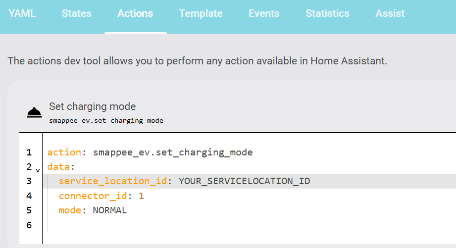

### ℹ️ Smappee EV usage and Entity Overview in Home Assistant

This integration exposes a variety of entities, buttons, and services that allow you to control and monitor your **Smappee EV Wallbox** via Home Assistant, or to be used in other third party EMS systems, such as [EVCC](https://github.com/myny-git/smappee_ev/blob/main/docs/EVCC.md), [emhass](https://github.com/myny-git/smappee_ev/blob/main/docs/emhass.md), and [openEMS](https://github.com/myny-git/smappee_ev/blob/main/docs/openEMS.md). Below you'll find a detailed explanation of each component and how to use them effectively in your automations, scripts, or dashboards.

> [!IMPORTANT]
> The Smappee APP is not so responsive. Better to use the online Smappee Dashboard to evaluate functionality. 

These entities are based on the [Smappee API](https://smappee.atlassian.net/wiki/spaces/DEVAPI/overview). Live state data is received from mqtt.smappee.net.

---

### 🔌 Smappee API Endpoints

The integration uses two distinct REST API endpoints for sending commands to the charger.

#### 1. `chargingstations` endpoint
```
PUT https://app1pub.smappee.net/dev/v3/chargingstations/{SERIALNUMBER}/connectors/{position}/mode
```
Designed specifically for **EV-line** charging stations. Accepts a JSON body with `mode` and an optional `limit`.  
Used in this integration for:
| Action | mode value | notes |
|--------|-----------|-------|
| Set mode to Normal | `NORMAL` | optional `limit` with `unit` (`AMPERE` or `PERCENTAGE`) |
| Pause charging | `PAUSED` | — |

> This endpoint is used by the `set_charging_mode_chargingstations` service.

#### 2. `smartdevices` endpoint
```
POST https://app1pub.smappee.net/dev/v3/servicelocation/{SERVICELOCATIONID}/smartdevices/{SMARTDEVICEUUID}/actions/{NAME}
```
The original Smappee smart device action API. Supports several named actions.  
Used in this integration for:

| Action name | Integration method | Description |
|-------------|-------------------|-------------|
| `startCharging` | `start_charging` | Start a session at a given current (converted to `percentageLimit`) |
| `setPercentageLimit` | `set_percentage_limit` | Set charging speed as a percentage of max current |
| `setPercentageLimit` | `set_current` | Set charging speed as a float Ampere value (converted internally to percentage) |
| `stopCharging` | `stop_charging` | Stop the active charging session |
| `pauseCharging` | `pause_charging` | Pause charging — recommended default (matches Smappee app behaviour) |
| `setChargingMode` STANDARD | `set_charging_mode` (STANDARD) | Set mode to Standard (equivalent to app Standard button; avoids session timeout issue #103) |
| `setChargingMode` SMART | `set_charging_mode` (SMART) | Set mode to SMART |
| `setChargingMode` SOLAR | `set_charging_mode` (SOLAR) | Set mode to SOLAR |
| `setAvailable` | `set_available` | Mark the station available for use |
| `setUnavailable` | `set_unavailable` | Mark the station unavailable for use |
| `setBrightness` | `set_brightness` | Set LED brightness (station-level) |

---

### 🛠️ Services

This integration firstly creates several services, which can be called directly in automations, scripts, or the Developer Tools → Actions (UI) in Home Assistant.



- **`smappee_ev.set_charging_mode`**  
Sets the desired charging mode (`STANDARD`, `SMART`, or `SOLAR`) via the **smartdevices endpoint**. This matches the Smappee app mode buttons exactly and avoids the session timeout issue described in issue #103. No current/percentage limit is used here; use the `max_charging_speed` number entity (or `set_percentage_limit`) to control charging speed independently.

- **`smappee_ev.set_charging_mode_chargingstations`**  
The legacy service for direct connector control via the `chargingstations` endpoint. Supports `NORMAL`, `SMART`, and `PAUSED`.
When using `NORMAL`, you can optionally pass a `limit` together with `limit_unit` (`AMPERE` or `PERCENTAGE`).
If you have multiple charging stations sharing connector `1` or `2`, also provide `charging_station_serial` so the integration can resolve the correct connector unambiguously.

- **`smappee_ev.start_charging`**  
Starts a charging session using a **current limit** parameter. Requesting this multiple times with different current levels has an impact, but you need to refresh your screen, or switch to another tab (like Smart) and return.

- **`smappee_ev.pause_charging`**  
Pauses the currently active charging session via the `smartdevices/actions/pauseCharging` endpoint (recommended — matches the Smappee app Pause button exactly).

- **`smappee_ev.pause_charging_chargingstations`**  
Pauses the currently active charging session via the `chargingstations` endpoint (`PAUSED` mode). Use as a fallback if your firmware does not respond to the smartdevices endpoint.

- **`smappee_ev.stop_charging`**  
Stops the charging session. 

- **`smappee_ev.set_current`**  
Sets the charging current in **Ampere with 1 decimal precision** (e.g. `11.4`). The value is translated to the nearest integer percentage of the connector's configured min–max range and sent via `setPercentageLimit`. The `max_charging_speed` slider and number entity update immediately, without waiting for the next poll.

### 🔘 Buttons, numbers and select entities
This integration also created a few buttons, number and select entities, which make use of aforementioned services. You can use them in your Home Assistant dashboards. Some entities will be created per connector number. 

- **`select.smappee_ev_YOURSERIAL_charging_mode_1`**  
Allows you to choose between the following official Smappee charging modes per connector (1 or 2), as they appear in the Smappee App or Dashboard:
  - `STANDARD`: Charges at a fixed current limit (set via the `max_charging_speed` entity)
  - `SMART`: Balances grid and solar energy
  - `SOLAR`: Charges using solar power only

- **`number.smappee_ev_YOURSERIAL_max_charging_speed_1`**  
Defines the current (in Amps, with 0.1 A precision) to be used when operating in `STANDARD` mode. Adjust this to match your desired charging speed. The value is converted internally to a percentage and sent via `setPercentageLimit`. This number will be available per connector (1 or 2). Some examples:
#### 🚗 Charging Power Table

| Current (A) | Power (1 phase, kW) | Power (3 phases, kW) |
|-------------|----------------------|------------------------|
| 6 A         | 1.38 kW              | 4.15 kW                |
| 8 A         | 1.84 kW              | 5.54 kW                |
| 10 A        | 2.30 kW              | 6.92 kW                |
| 16 A        | 3.68 kW              | 11.07 kW               |
| 24 A        | 5.52 kW              | 16.61 kW               |
| 32 A        | 7.36 kW              | 22.14 kW               |

- **`number.smappee_ev_YOURSERIAL_min_surplus_percentage_1`**  
[Explanation from the website of Smappee]

This slider sets **how much of the minimum required current (6A or 3x6A)** must be covered by surplus solar production before charging starts. You can thus reduce the percentage of surplus needed to begin charging.

| Slider Value [%] | Charging of your EV |
|------------------|--------------------|
| 0   | The charger always charges at minimum speed (Single phase: 1.4 kW, Three phase: 4.2 kW) and increases speed when more surplus solar is available. |
| 25  | 25% must come from the solar panels, 75% from the grid (Single phase: 0.35 kW export, Three phase: 1.05 kW export). |
| 50  | 50% must come from the solar panels, 50% from the grid (Single phase: 0.7 kW export, Three phase: 2.1 kW export). |
| 100 | 100% must come from the solar panels (Single phase: 1.4 kW export, Three phase: 4.2 kW export). |


> **Note:**  
> There is a known issue in the Smappee app:  
> While the minimum surplus percentage works and updates correctly in the online dashboard, you may need to swap modes and return to see the change reflected on the dashboard—it does not update live. Somehow, the app never gets updated!

- **`number.smappee_ev_YOURSERIAL_led_brightness`**  
Sets the desired brightness level for the Wallbox LEDs, from 0 to 100%.
   
- **`button.smappee_ev_YOURSERIAL_set_charging_mode_1`**  
Applies the currently selected `charging mode` from the select entity via the `smartdevices` endpoint. The mode is STANDARD, SMART or SOLAR. Use this after changing the mode to activate it on the Wallbox. It is connector-specific.

- **`button.smappee_ev_YOURSERIAL_start_charging_1`**  
Starts a charging session using the value set in `max_charging_speed`. Pressing multiple times with different current levels has an impact, but you need to refresh your screen! Also connector-specific.

- **`button.smappee_ev_YOURSERIAL_pause_charging_1`**  
Pauses the ongoing charging session. Charging can later be resumed.

- **`button.smappee_ev_YOURSERIAL_stop_charging_1`**  
Stops the current charging session entirely. Useful for ending sessions manually or through automations. Also connector-specific.

### 📈 Sensor Entities

**`sensor.smappee_ev_YOURSERIAL_connector_1_charging_state`**  
Reports the current session state per connector ID. Possible values include:
- `STARTED`: An active charging session is ongoing.
- `SUSPENDED`: Charging is suspended, e.g., due to insufficient solar power or limits, or when you PAUSED the charging.

**`sensor.smappee_ev_YOURSERIAL_connector_1_evcc_state`**  
Displays the EVCC (Electric Vehicle Communication Controller) state of the Wallbox, per connector ID, following IEC 61851:
- `A`: No vehicle connected
- `B`: Vehicle connected but not ready
- `C`: Vehicle connected and ready for charging
- `E`: Error state

**`sensor.smappee_ev_YOURSERIAL_connector_1_evse_status`**  
Displays the state of the Wallbox, per connector ID, similar as on the dashboard

**`sensor.smappee_ev_YOURSERIAL_connector_1_session_energy`**  
Shows the energy of the current or most recent Smappee cloud charging session for this connector, in kWh.
The sensor is populated from the `chargingstations/{station_uuid}/sessions` API endpoint and is refreshed around charging session state changes.

The sensor state is the session energy. The extra attributes contain the remaining session metadata returned by Smappee:

| **attribute** | **explanation** |
|:-------------:|:----------------|
| `id` | Unique Smappee charging session ID. Home Assistant may display this as `ID`. |
| `serialNumber` | Charging station serial number reported by Smappee. |
| `connector` | Connector position used by the session. |
| `from` | Session start time, converted to an ISO timestamp. |
| `to` | Session end time, converted to an ISO timestamp when available. |
| `status` | Smappee session status, for example `STARTED` or `STOPPED`. |
| `suspendedByUser` | Whether the session was paused by the user. |
| `externalControl` | Whether the session was controlled externally. |
| `smartMode` | Smappee smart charging mode for the session. |
| `priority` | Session priority reported by Smappee. |
| `minimumExcessPercentage` | Minimum excess solar percentage used for smart charging. |
| `maxAmperes` | Maximum configured current values for the session. |
| `startReading` | Meter reading at the start of the session. |
| `stopReading` | Meter reading at the end of the session. |
| `duration_minutes` | Calculated session duration in minutes. |

**`binary_sensor.smappee_ev_YOURSERIAL_mqtt_connected`**  
Displays the state of the MQTT connection, per connector ID

**`sensor.smappee_ev_YOURSERIAL_mqtt_last_seen`**  
Shows when the MQTT has been updated

### EVCC specific entity

**`switch.smappee_ev_YOURSERIAL_connector_1_evcc_charging`**  
The integration of EVCC requires a switch (per connector ID), which:
- `turn_on`: calls `set_charging_mode` with `STANDARD` (smartdevices endpoint — matches Smappee app behaviour).
- `turn_off`: calls `pause_charging` (smartdevices endpoint).
Please see the [EVCC](https://github.com/myny-git/smappee_ev/blob/main/docs/EVCC.md) documentation for the usage.

### 📈 Power/Current/Energy Sensors

We display here all data from the MQTT session. Depending on your installation, some sensors will not have any data and need a manual disable action.

| **entity** | **explanation** |
|:----------:|:---------------:|
|  `connector_current` |   Live currents of your specific connector  |
|      `connector_current` per phase     |      Live phase currents of your specific connector     |
|     `connector_energy`        |    The energy in kWh of your connector             |
|     `connector_session_energy`        |    The energy in kWh of the current or most recent Smappee cloud charging session. Session details are available as attributes.             |
|     `connector_power`        |    The power in W towards your connector             |
|     `support_grid`        |    Maximum grid assistance current (A) for this connector. Read from the charger configuration (`max.gridassistanceamps`). Will be unavailable if the charger does not report this property.             |
|     `grid_current`        |    The total current of your grid. Each phase current can be found in the attributes             |
|     `grid_energy_export`        |    The total energy export of your grid.           |
|     `grid_energy_import`        |    The total energy import of your grid.           |
|     `grid_power`        |    The total live power of your grid. (Can be negative)           |
|     `house_consumption_power`        |    The total live power of your house consumes.          |
|     `PV_current`        |    The total current your PV generates. Each phase current can be found in the attributes             |
|     `PV_energy_import`        |    The total energy import of your PV.           |
|     `PV_power`        |    The total live power your PV system generates.           |
